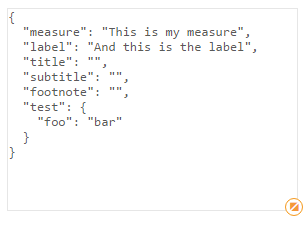

## Debug Information in Widgets

When working with data resp. properties in your widgets, it's quite often useful to get the current state of the AngularJS scope, so that you can validate the output or just to get a better understanding of the underlying data-structure.

### Just Render it ...

The easiest way to get some insights of the internal data-structures is to just render it using pure AngularJS functionality and data binding:

```html
<div class="json" ng-bind="settings | json" />
```
returns the following in the preview area


*The AngularJS filter `json` ([> docs](https://docs.angularjs.org/api/ng/filter/json)) actually converts and object to JSON and therefore allows you to see all properties of the given object.*

This becomes even more useful if you use `pre` for a better readable output:

***Html***

```html
<pre class="json"  ng-bind="settings | json" />
```


***CSS***

```css
.json {
	font-family: monospace;
}
```

***Result***


 

### Using Chrome's DevTools & `qw-console`

There is an experimental component available (as of Qlik Sense 3.0) which allows you to output some information in the developer's console: `<qw-console />`.
Just use it anywhere in the Html area as follows:

***Example:***

```html
<qw-console log="settings" />
```
returns then

