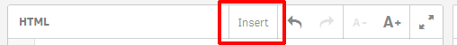

# Show / Hide

> Demonstrates how to show / hide parts of your object


## Step by Step

First create a property using the Property Panel Builder:

- Drag the "Header" element to the property panel preview
- Expand the "Header" element (by default called "Settings")
- Drag & Drop the "Checkbox" element inside "Settings"
- Make some changes to the newly added "Checkbox" element:


Then use the following code:

```html
<div ng-show="true">
	The condition has been evaluated to TRUE
</div>
<div ng-hide="true">
	The condition has been evaluated to FALSE
</div>
```

Now replace the conditions with a reference to the previously created property. The easiest way to achieve that is to use the "Insert" dialog:



Switch to "Property references" and select "Settings" in the Dropdown list:


Insert the value inside of `ng-hide` resp. `ng-show`.

Now your code should be as follows:

```html
<div ng-show="settings.showDetails">
	The condition has been evaluated to TRUE
</div>
<div ng-hide="settings.showDetails">
	The condition has been evaluated to FALSE
</div>
```

If you now change the value of the property in the property panel, either the hide or show condition will be evaluated to true.

## Reference

- [AngularJS Documentation for ngShow/ngHide](https://docs.angularjs.org/api/ng/directive/ngShow)
