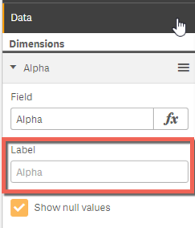
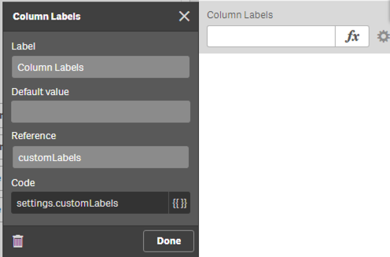
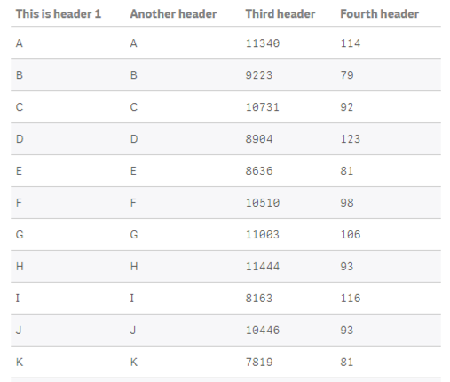

[Paul Nowicki](https://community.qlik.com/people/pnowicki) is asking the following question on [Qlik Community](https://community.qlik.com/message/1106071):

> I'm currently trying to create a widget table where I can have dynamic column labels.  This is my attempt at a workaround for Qlik Sense's lack of dynamic labels.  Has anyone done this before and can share their widget code?

## No magic solution

When defining dimensions and measures in Widgets you actually run into the same situation as when working with native visualizations: The label cannot be defined by using an express:



## A proposed solution

But due to the flexibility of Widgets there is at least a feasible workaround - even if not 100% user-friendly.

### Preparation

- Create a widget, add the data-section to the property panel and define the desired amount of dimensions and measures.
- Next create a header and an input object, configured as follows:



- Now let's add the basic code snippet for creating a table and add some dimensions and measures:

Basic table snippet (from the snippet dialog):
```html
<table border="1">
	<thead>
	<tr>
		<th ng-repeat="head in data.headers">
			\{{head.qFallbackTitle}}
		</th>
	</tr>
	</thead>
	<tbody>
	<tr ng-repeat="row in data.rows">
		<td ng-repeat="cell in row.cells">
			\{{cell.qText}}
		</td>
	</tr>
	</tbody>
</table>
<div ng-if="data.rows.length === 0">
	Please add dimensions and measures.
</div>
```

- In the `customLabels` input field let's define some custom labels, separated with a semi-colon, e.g.:

```
This is header 1;Another header;Third header;Fourth header
```

Now all we have to do is to change the section of the code-snippets where the headings of the table are rendered:

```html
...
	<thead>
	<tr>
		<th ng-repeat="head in data.headers">
			\{{settings.customLabels.split(';')[$index]}}
		</th>
	</tr>
	</thead>
...
```

So how does this work:
- The content of `settings.customLabels` will first be converted to an array using JavaScript's split method
- Then for each column index, the right one will be taken and rendered

That's the result:
_(used some stylesheet to make it a bit nicer)_



## Better solution

If you have a better solution for this challenge, please do not hesitate to post your findings in the comment section below!
