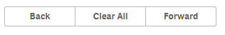

The following actions can be used to make your widget more interactive with Qlik Sense:


- `app.clearAll` - Clear all selections.
- `app.back()` – Back to the previous selection
- `app.forward()` – Forward to the next selection
- `navigation.nextSheet()` – Jump to the next sheet
- `navigation.prevSheet()` – Jump to the previous sheet
- `navigation.gotoSheet(<sheetId>)` – Jump to a sheet, defined by Id
- `navigation.gotoStory(<storyId>)` – Jump to a story, defined by Id

*This is just an excerpt of the available actions, for a full list, have a look at the {{#hl}}App API{{/hl}} or the {{#hl}}Navigation API{{/hl}}*

## Usage
Bind your widget with an action using e.g. `ng-click` (in case of a button):

**Html:**
```html

<button ng-click="app.clearAll()">Clear All</button>

```

Note: To apply styles, e.g. use the Leonardo-UI styles.


## Example

This example uses Leonardo-UI styles an some of the predefined actions:

**Html:**
```html
<lui-buttongroup>
	<lui-button ng-click="app.back();">Back</lui-button>
	<lui-button ng-click="app.clearAll();">Clear All</lui-button>
	<lui-button ng-click="app.forward();">Forward</lui-button>
</lui-buttongroup>
```

```css
& {
	padding:10px 10px 10px 10px;

  .lui-button {
	  min-width:100px;
  }
}

```

**Result:**




## FAQ:

**Q: Is it possible to define custom actions?**
A: Right now, this is not possible, but on the roadmap for future versions.
