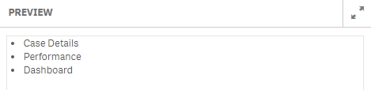
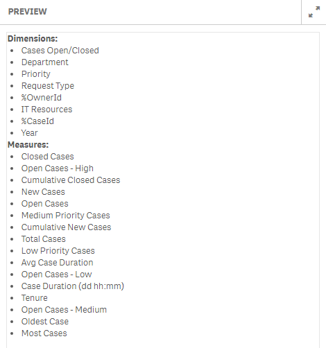

## Introduction

You can retrieve system meta-information to support the development process of widgets or you can add system meta information to custom visualizatons using the qw-sys-info component. The following system metadata information can be retrieved:

- All apps.
- Sheets and objects in the current app.
- Visualizations in the current app.
- Dimensions and measures in the current app.
- All visualization extensions available.
- All widgets available.
- All bookmarks available.
- All current selections.
- All master objects.

## Usage

**Html:**
```html
<qw-sys-info content="sheets">
	<ul style="margin-left:20px;">
		<li ng-repeat="sheet in sheets"
			ng-bind="sheet.qMeta.title" />
	</ul>
</qw-sys-info>
```

**Result:**
(when Helpdesk Management app is selected)



## Properties

The following properties can be used, separated by commas to fetch system information:

- apps
- sheets
- fields
- measures
- dimensions
- extensions
- bookmarks
- currentselections
- masterobjects
- visualizations

## Multiple information

You can not only fetch one entity but you can combine multiple as shown in the example below:

```html
<qw-sys-info content="dimensions,measures">
	<b>Dimensions:</b><br>
	<ul style="margin-left:20px;">
		<li ng-repeat="dimension in dimensions" ng-bind="dimension.qMeta.title">
	</li></ul>
	<b>Measures:</b><br>
	<ul style="margin-left:20px;">
		<li ng-repeat="measure in measures" ng-bind="measure.qMeta.title">
	</li></ul>
</qw-sys-info>
```


