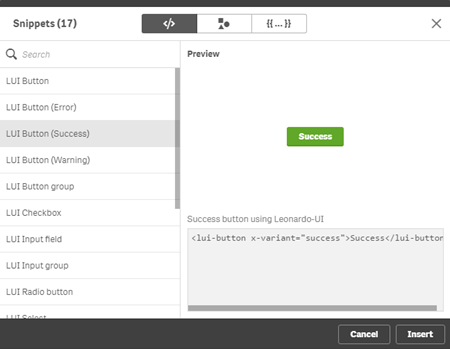
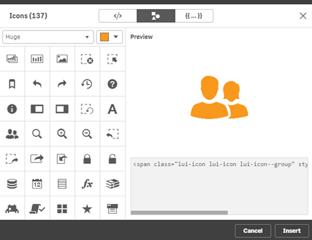
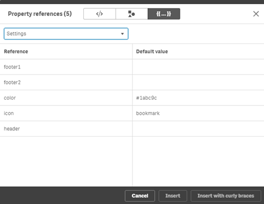
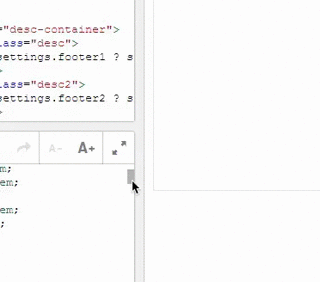
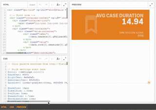
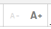

## The Widget Editor

The Widget editor is the main tool for a [Widget creator](../personas/#widget-creator) to design, create and develop a widget.

### Launch the Widget editor

Access the Widget editor through Dev Hub either by opening an existing Widget library or by just opening the tool.

### The structure

It seems to be unnecessary to describe a UI, but it is on the other hand important to understand some basic concepts of the Widget editor.

First of all the UI of the Widget editor is separated into different areas:

1) Asset panel
2) Editor
3) Immediate preview 
4) Property panel / Property panel builder

### Insert dialogs

Use the insert dialog to easily insert

- Code snippets
- Icons
- Properties

**Code snippets**

**Icons**

**Properties**

### Little convenience helpers

The Widget editor includes some nice little helpers to make the work with Widget more enjoyable:

**Adapt coding areas**

**Distraction free mode & resizable preview**

Focus on what you are working on, all-together, only Html, only CSS, etc.

**Resizable font size**

Adjust the font size of the code areas. Especially useful if you present Widget on stage or in a presentation.

