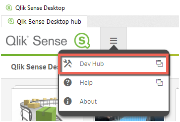
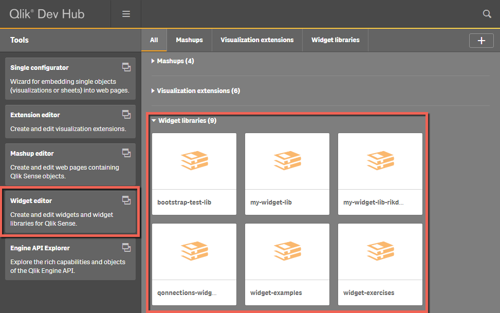

All you need for the following exercises are

- Qlik Sense Desktop 3.x or
- Qlik Sense Server 3.x

In case of Qlik Sense Server open [http[s]://server-name/hub](http[s]://server-name/hub), in case of Qlik Sense Desktop open [http://localhost:4848/hub](http://localhost:4848/hub)

## Open Dev Hub
In the hub go to the menu and open Dev Hub:

*Note: In case of Qlik Sense Desktop a new browser window will be opened, minimize the instance of Qlik Sense Desktop while working in the newly opened browser window.*

In **Dev Hub** you will not only see a new link pointing you to the Widget editor, but also all existing Widget libraries will be shown:

