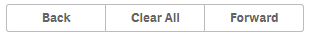
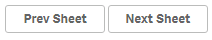

## Exercise

- Start with a new widget (in your existing library)
- Use the insert dialog to insert nicely formatted buttons from the Leonardo UI library
- Add one of the predefined actions by using `ng-click`
- Add some buttons and test the functionality by adding a Widget instance to one of your sheets. 

## Solution Path

This shows a sample widget using several actions:

**Html**

```html
<lui-buttongroup>
	<lui-button ng-click="app.back();">Back</lui-button>
	<lui-button ng-click="app.clearAll();">Clear All</lui-button>
	<lui-button ng-click="app.forward();">Forward</lui-button>
</lui-buttongroup>
```


**CSS**

```css
& {
	padding:10px 10px 10px 10px;

  .lui-button {
	  min-width:100px;
  }
}
```

**Result**




And another sample widget using actions:


**Html**
```html
<lui-button ng-click="navigation.prevSheet()">Prev Sheet</lui-button>
<lui-button ng-click="navigation.nextSheet()">Next Sheet</lui-button>
```


**CSS**
```css
& {
	padding:10px 10px 10px 10px;

  .lui-button {
	  min-width:100px;
  }
}
```

**Result**




## Sample Solution

By opening the widget "Result: Actions" (widget library "widget-exercises") you can have a look at a proposed solution.


## Bonus Exercise

- Use the newly created widget in combination with a KPI tile to see changes made in selections.
