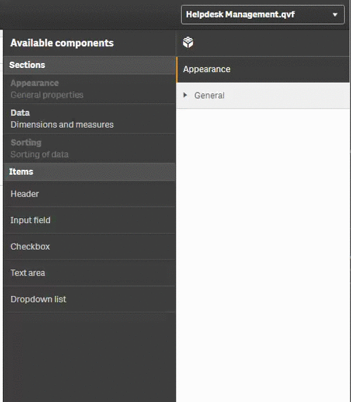

We have already touched some very basic concepts of AngularJS in previous chapters.

Now let's work on an example how to bind some logic to a property in the property panel. We want to show some conditional content, depending on whether a checkbox is checked or not.

Let's start with the exercise "Exercise: AngularJS Binding", then follow these steps:

- Create a checkbox property, give it a label "Show Details" and a reference named "`showDetails`"
- Create some nicely formatted content which
    - is only displayed if `showDetails` is not checked
    - is only displayed if `showDetails` is checked


## Solution

First create the property:



Then let's add some Html code

```html
<div class="details">
    "Show Details" has been checked ...
</div>
<div class="eof">
	Nothing to show, please enable "Show Details" ...
</div>
```

... and the corresponding CSS code

```css
.details {
	ul {
	margin-left:30px;
	}
}
.eof {
	color: #990000;
	font-weight: bold;
}
```

Not really exciting so far, let's add the magic stuff.
We are now using a - so called - AngularJS directive which removes or adds a portion of the HTML shown in the browser depending on a condition - in our case the value of the property `showDetails` (which can either be `true` or `false`).

***Modified Html:***

```html
<!-- Render only if showDetails is checked, and therefore equals to false -->
<div class="details" ng-if="settings.showDetails">
...
</div>

<!-- Render only if showDetails is NOT checked, and therefore equals to false --->
<div class="eof" ng-if="!settings.showDetails">
...
</div>
```


OK, much better, we have now a working conditional rendering, based on the value of the property `showDetails`:


**Finally:**
A proposed solution can be found in the widget "Result: AngularJS Binding".

## References

- [AngularJS: ngif](https://docs.angularjs.org/api/ng/directive/ngIf)
- [AngularJS: ngshow](https://docs.angularjs.org/api/ng/directive/ngShow)
- [AngularJS: nghide](https://docs.angularjs.org/api/ng/directive/ngHide)
