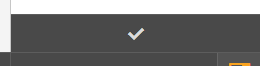
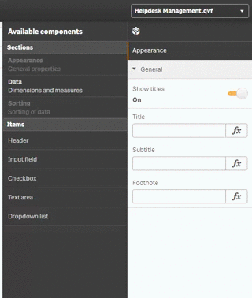
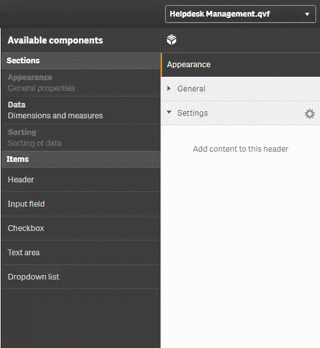
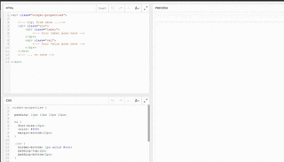
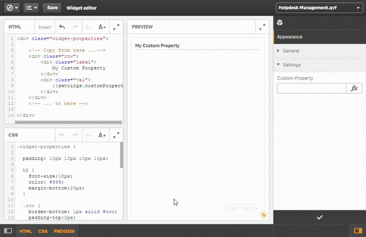

As we now know how to bind properties to the widget output, let's create some custom properties (using the Property Panel builder).

One of the essential concepts behind widgets is that the widget creator can define how the widget instance can be configured by the end-user. Therefore - as a widget creator - you can define properties, which define the behavior of your widget and which can then be used by the user.

## Helper for the following exercises

As a little helper for the following exercises use the existing widget called "Exercise: Custom Properties" from widget library "widget-exercises".

This provides some CSS and a little code snippet which makes it easier to output some values:

***Html:***
```html
<div class="widget-properties">

	<!-- Copy from here ...-->
	<div class="row">
		<div class="label">
			<!-- Your label goes here -->
		</div>
		<div class="val">
			<!-- Your value goes here -->
		</div>
	</div>
	<!-- ... to here -->
	
</div>
```

***CSS:***
```css
.widget-properties {

  padding: 10px 10px 10px 10px;

  h2 {
	font-size:18px;
	color: #999;
	margin-bottom:20px;
  }

  .row {
	border-bottom: 1px solid #ccc;
	padding-top:2px;
	padding-bottom:2px;
  }

  .row:after {
	 content: ".";
	 display: block;
	 height: 0;
	 clear: both;
	 visibility: hidden;
  }

  .row .label {
	 font-weight: bold;
	 min-width: 100px;
	 display:inline-block;
	 padding-right:20px;
  }

  .row .val {
	 display:inline-block;
  }

  .row:nth-child(2n) {
	  background-color:#F7F7F9;
  }
}
```


## Exercise 1: Create a basic input field

- Create a basic input field using the Property Panel builder
- Render the value of the input field in your widget

## Exercise 2: Create a drop-down

- Create a property using the drop-down type
- Render the selected value in your widget

## Exercise 3: Create a drop-down and create a binding in CSS

- Create another drop-down field
- Add some values, representing the background-color of your widget
- Bind the value not to Html, but use it in your CSS declaration

---

{{#hl}}Don't proceed, first try it, then have a look at the solution ;-){{/hl}}


## Solution exercise #1: Create a basic input field

Assuming that you are using the existing widget "Exercise: CustomProperties" you can succeed with exercise #1 by following these steps:

**1) Open the Property Panel builder**



**2) Create a new property**
**2a) First create a new header**
Drag and drop the header to the Property Panel.



**2b) Add a new item to the new header**



**2c) Finish the editing mode of the Property Panel builder**

**3) Create a reference to the property in your HTML**



**4) Test the property**

Now you can change the value of the property and you'll get an updated widget depending on what you've entered in the property object.




