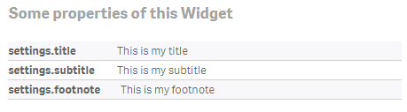

--- 
title: "Basic Data Binding"
sub-title: "Data binding is the essential concept to make your Widgets useful and re-usable."
---

## Exercise

- Create a new widget, call it “Data-Binding” or use the existing widget “Exercise-DataBinding” from the widget library “widget-exercises”.
- Now let's visualize the default properties which are always available, for every widget:
    - Title
    - Subtitle
    - Footnote
- Use the “Insert” dialog to insert references to the HTML area using the double curly braces syntax, e.g. `{{settings.title}}`
    - Alternatively use AngularJS’ directive `ng-bind` which is a bit harder to read, but from a performance perspective the preferred option.  
    (there is an example in the existing widget “Exercise-DataBinding”    
- Save the widget and double-check if rendering and the added properties work properly in an existing app.

The final result should render a table with some properties in a format similar like the following one:

## Solution

By opening the widget "Result-Databinding" you can have a look at the proposed solution.
