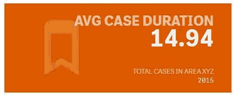

Now we have learned the basics. Let's use all the concepts together to create an advanced KPI tile.

## Goal

The KPI tile should offer the following functionality:

- The user can add one or more (up to three) measures to be displayed
- In the first view only the most important KPI will be shown, the user has the possibility to show more KPIs on demand
- The user should be able to add an explanatory description
- The user can select the style in the property panel
    - The style also includes an icon displayed next to the KPIs
- The user should be able to define a URL, which will represent a web-page, containing more details about the KPIs
- The KPI tile should be fully responsive

## Solution

Have a look into the "Drill KPI", part of the sample widgets, delivered with Qlik Sense.
