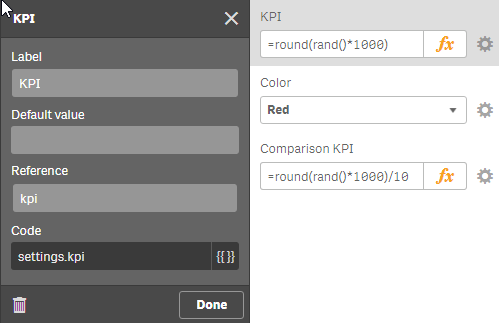
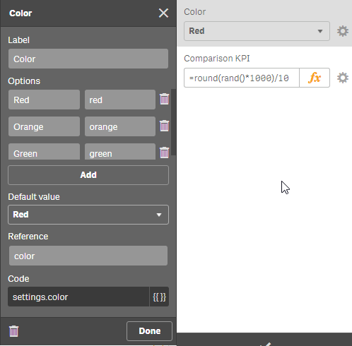
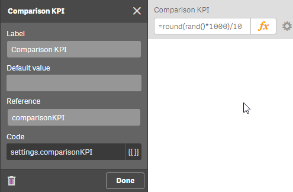
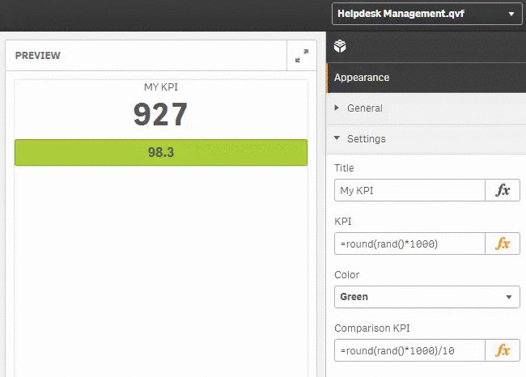

## Exercise 

Start by using the existing widget template “Exercise: Minimalistic KPI” in the widget library “widget-exercises”.
- Create a new header in the property panel called “Settings”
- Create the following custom properties using the Property Panel editor
    - Title (Input, name “Title”, reference `kpiTitle`)
    - KPI (Input, name “KPI”, reference `kpi`)
    - Color, containing the values “red”, “green” & “orange” as keys, choose appropriate labels (reference `color`)
    - Comparison KPI (Input, reference `comparisionKPI`)
- First extend the existing Widget to make it fully dynamic
    - Title, KPI and the color should be bound to the properties defined by the user.
- Test the KPI extensively in an existing app

{{#hl}}Don't proceed, first try it, then have a look at the solution ;-){{/hl}}

## Solution

First create the properties:

**`kpiTitle`**


**`kpi`**



**`color`**



**`comparisonKPI`**



Now let's add bind the HTML output to some of the properties:

```html
<div class="wiSimpleTile">
    <div class="header">\{{settings.kpiTitle}}</div>
    <div class="measure">\{{settings.kpi}}</div>
    <div class="bar">\{{settings.comparisonKPI}}</div>
</div>
```

So far we have bound all properties, except the `color` property.
And here comes a nice trick:

- If you have a look at the CSS, you'll find some classes there:
    - `.bar-green`
    - `.bar-orange`
    - `.bar-red`
- Now let's bind to these classes, depending on the selected color:

```html
...
<div class="bar bar-\{{settings.color}}">\{{settings.comparisonKPI}}</div>
...
```

## The Final Result


A proposed solution can be review in the widget "Result: Minimalistic KPI" (widget library "widget-exercises").
