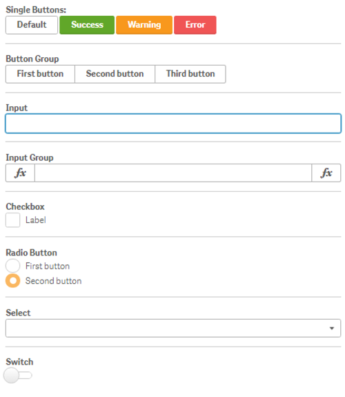

## Exercise

- Create a new widget and call it “Leonardo-UI”
- Use the “Insert” dialog to add code snippets using Leonardo-UI

## Bonus exercise

- Make e.g. a ButtonGroup dynamic by combining Leonardo-UI and AngularJS

## Solution

This is how your widget could look like:

A possible result can be seen in “Result: Leonardo-UI” as part of the widget library “widget-exercises”.

